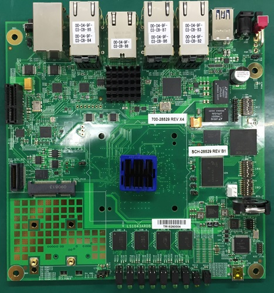

# Linux on the NXP LS1043a

Build instructions, custom files, manuals for building Linux on
the NXP LS1043a

One Notable item here is the capability of booting from a SATA drive.
See file howto_boot_sata.txt.

See the file instructions.txt in order to get started with installing
and booting Linux on the LS1043a.

--------

